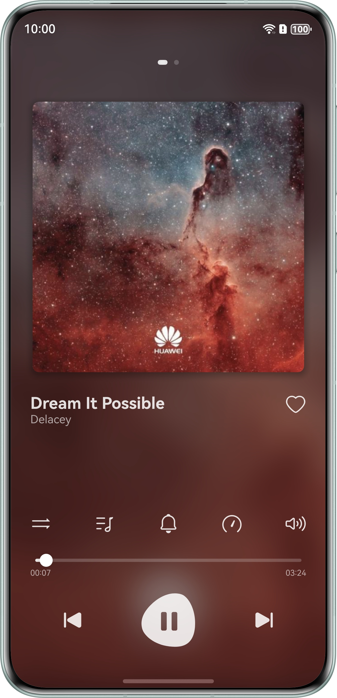
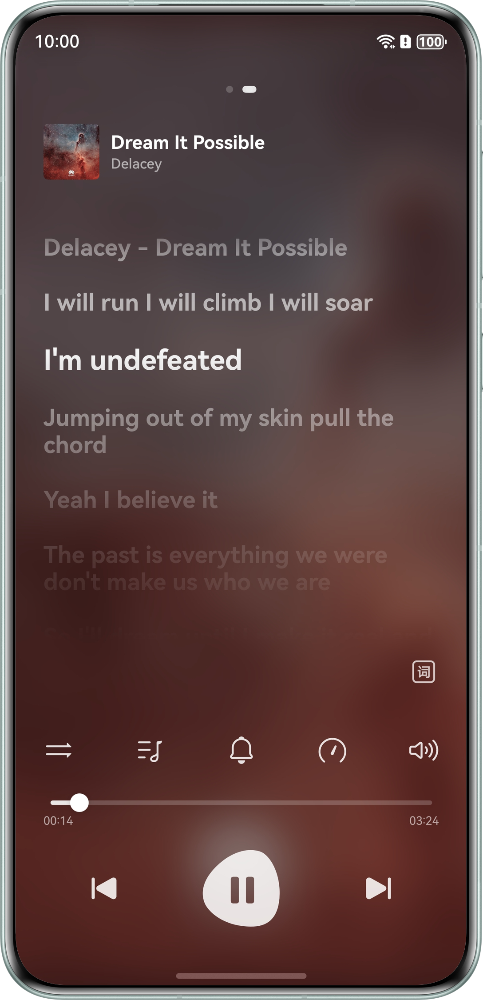
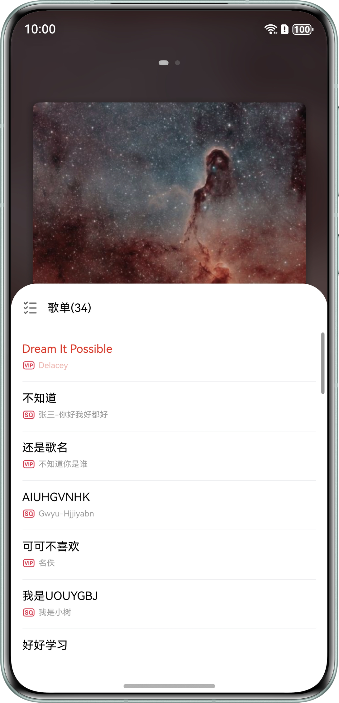
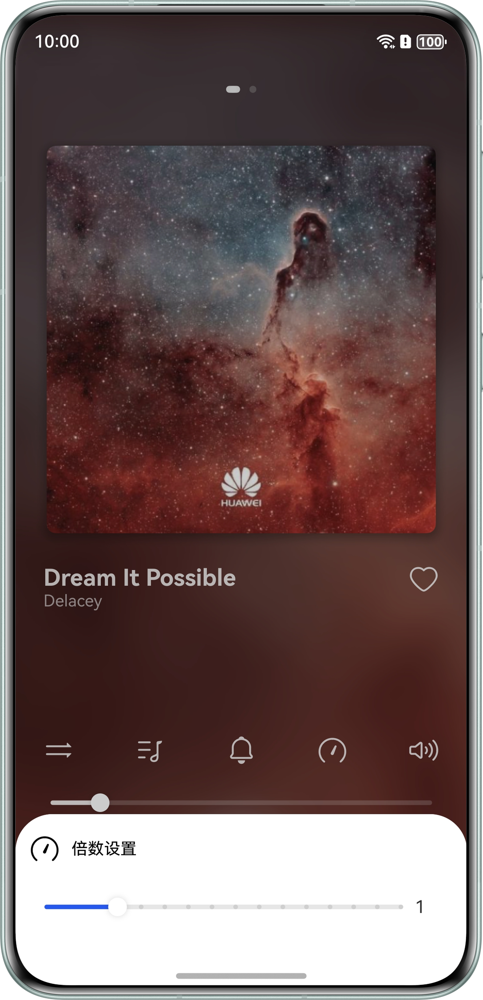

# 基于AVPlayer播放格式化音频（ArkTS）

## 项目简介
本场景解决方案主要面向前台音频开发人员。指导开发者基于AVPlayer开发音频播放功能，AVPlayer用于播放格式化音频（MP3、WAV、FLAC等）。功能包括后台播放、和播控中心的交互、适配不同类型的焦点打断策略、切换输出设备、倍数播放、音量调节等基础音频常见功能。

## 使用说明
1. 播放功能：运行工程，进入首页后，点击底部播放按钮，可播放音乐。
2. 切歌功能：播放按钮两侧有切歌按钮，点击切换上一首下一首。
3. 进度跳转功能：推动播放按钮上面的播放条，可以调整歌曲进度。
4. 循环模式：点击进度条上部，左侧第一个图标，可以切换不同播放模式，支持的模式有“顺序播放”、“单曲循环”、“随机播放”。
5. 歌单列表：点击进度条上部，左侧第二个图标，可以打开歌曲列表，点击歌曲名称，可以切换播放歌曲。
6. 静音播放：点击进度条上部，左侧第三个图标，可以打开静音播放功能。
7. 倍数设置：点击进度条上部，左侧第四个图标，可以调整歌曲播放速度。
8. 音量设置：点击进度条上部，左侧第五个图标，可以调整歌曲播放音量。
9. 收藏：点击页面“爱心”图标，将歌曲变成已收藏状态，可以同步至播控中心。

## 效果预览

| 主页面                                                | 歌词页                                                | 歌单列表                                                  | 倍数设置                                               |
|----------------------------------------------------|----------------------------------------------------|-------------------------------------------------------|----------------------------------------------------|
|  |  |  |  |

## 工程目录
```
├──entry/src/main/ets/
│  ├──common
│  │  ├──constants                                        // 常量
│  │  │  ├──BreakpointConstants.ets                       // 断点常量
│  │  │  ├──ContentConstants.ets                          // 内容常量
│  │  │  ├──LyricConst.ets                                // 歌词常量
│  │  │  ├──PlayerConstants.ets                           // 播放常量
│  │  │  └──StyleConstants.ets                            // 顶部区域组件
│  │  └──utils                                            // 工具函数
│  │     ├──mediautils                                    // 媒体方法
│  │     │  ├──AVPlayerController.ets                     // AVPlayerController播放类
│  │     │  ├──AVSessionController.ets                    // 播控中心控制类
│  │     │  ├──MediaControlCenter.ets                     // 媒体控制中心类
│  │     │  ├──MediaControlCenterCallbackAction.ets       // 媒体控制中心回调函数响应类
│  │     │  ├──MediaControlCenterHandle.ets               // 媒体控制中心句柄类
│  │     │  └──MediaTools.ets                             // 媒体工具处理类
│  │     ├──BackgroundUtil                                // 后台任务类
│  │     ├──BreakpointSystem                              // 断点系统类
│  │     ├──ColorConversion                               // 颜色转换类
│  │     ├──Logger                                        // 日志类
│  │     ├──LrcUtils                                      // 歌词工具类
│  │     ├──PreferencesUtil                               // 首选项工具类
│  │     └──ResourceConversion.ets                        // 资源工具类
│  ├──components                                          // 组件
│  │  └──CustomButton.ets                                 // 公共按钮
│  ├──entryability
│  │  ├──EntryAbility.ets                                 // Ability的生命周期回调内容
│  │  └──InsightIntentExecutorImpl.ets                    // 意图框架回调内容
│  ├──entrybackupability
│  │  └──EntryBackupAbility.ets                           // EntryBackupAbility的生命周期回调内容
│  ├──model
│  │  └──SongListData.ets                                 // 歌单列表数据
│  ├──pages
│  │  └──Index.ets                                        // 首页
│  ├──view
│  │  ├──ControlAreaComponent.ets                         // 控制区域组件
│  │  ├──LrcView.ets                                      // 歌词显示组件
│  │  ├──LyricsComponent.ets                              // 歌词组件
│  │  ├──MusicInfoComponent.ets                           // 音乐详情组件
│  │  └──PlayerInfoComponent.ets                          // 播放详情组件
│  └──viewmodel
│     ├──LrcEntry.ets                                     // 歌词数据类型
│     ├──SongData.ets                                     // 歌曲基础数据类型
│     ├──SongDataSource.ets                               // 歌曲列表数据源
│     └──SongItemBuilder.ets                              // 歌曲列表数据构造
└──entry/src/main/resources                               // 应用静态资源目录
```

## 具体实现
1. 播放功能：本文使用AVPlayer接口实现音频播放功能。从rawfile目录下获取音频文件后，通过AVPlayerController接口实现播放功能。
2. 倍速、音量、静音模式功能调用的是AVPlayer自身的接口，详细接口使用可见具体代码。
3. 循环模式和收藏模式的状态切换，依赖本地数据和AVSession交互，达到应用内界面和播控中心状态的同步。


## 相关权限
1. 后台任务权限：ohos.permission.KEEP_BACKGROUND_RUNNING。

## 依赖
不涉及

## 约束与限制
1. 本示例仅支持标准系统上运行，支持设备：直板机。
2. HarmonyOS系统：HarmonyOS 6.0.0 Release Release及以上。
3. DevEco Studio版本：DevEco Studio 6.0.0 Release及以上。
4. HarmonyOS SDK版本：HarmonyOS 6.0.0 Release SDK及以上。


